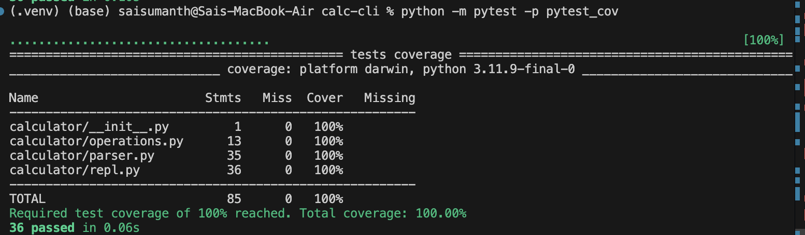

# calc-cli

A robust command-line calculator with a REPL, full unit tests, and CI that enforces **100% coverage**.

## Features
- REPL: `help`, `quit`, and arithmetic commands (`+ - * /` or `add sub mul div`)
- Clear prompts, validation, and graceful error handling
- DRY, modular design: parsing, operations, and REPL separated
- Pytest suite (including parameterized tests)
- GitHub Actions workflow fails if coverage < 100%

## Quickstart

### 1) Create and activate virtual environment
```bash
python -m venv .venv
# macOS/Linux:
source .venv/bin/activate
# Windows (PowerShell):
.venv\Scripts\Activate.ps1

```bash
----

### 2) DRY Principle in Action
This project avoids duplication through modular design:
- **Single source of truth for operations**:  
  All arithmetic functions (`add`, `sub`, `mul`, `div`) live in `operations.py`.  
  A single dictionary `OPS` maps user commands to these functions, eliminating repetitive `if/else` logic.
- **Dedicated parser module**:  
  `parser.py` encapsulates input parsing and validation. The REPL simply delegates, rather than duplicating parsing logic.
- **Test reuse**:  
  Parameterized tests in `pytest` cover multiple scenarios without repeating test code.

This separation ensures that if logic changes (e.g., adding new operations), updates occur in **one place only**.

---

### Usage

Run the REPL:
python -m calculator.repl

Example session:
Welcome to calc-cli! Type 'help' for usage, 'quit' to exit.
> help
Usage:
  <op> <a> <b>
  where <op> is one of: +, -, *, /, add, sub, mul, div
Commands:
  help  - show this message
  quit  - exit the calculator
Examples:
  + 2 3     -> 5
  div 10 2  -> 5

> quit
Goodbye!

### For testing:
Tests are written using pytest with pytest-cov for coverage reporting.
All modules are fully tested, including edge cases like division by zero and REPL exit commands.

python -m pytest -p pytest_cov

All tests achieve 100% coverage, as shown below:



A GitHub Actions workflow (ci.yml) ensures:

Dependencies are installed

Tests run on every push and pull request

Coverage is enforced at 100% — the build fails if even one line is untested

This guarantees consistent quality and avoids regressions.